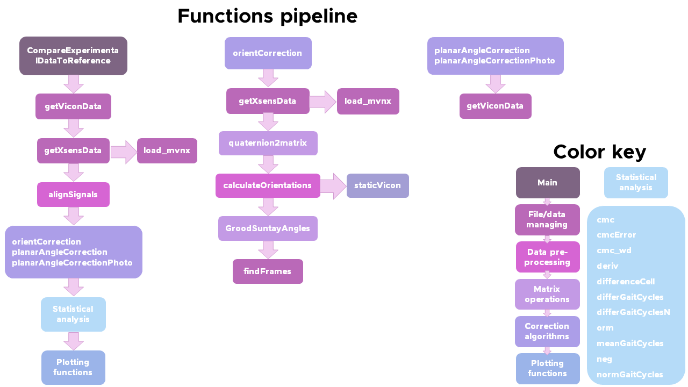

# Masters thesis
This repository contains the code used for my [Master's thesis](http://hdl.handle.net/1807/70400).

We wanted to use a weareable motion capture system, to analyze the movement of people with physical disabilities, but the sensors needed an upright posture to be calibrated. Hence using the sensors with people that couldn't stand upright, generated errors in the measurements. In my thesis I developed two algorithms to correct for this "posture" error. For more infomration you can read my thesis [here](http://hdl.handle.net/1807/70400).

This repo contains the code I used to correct the signals. The data is only available upon request and on a base-to-base case, since it belongs to the facility where the experiments took place. 

A diagram of the functions pipeline is shown below. The diagram describes the order in which functions are called. 

